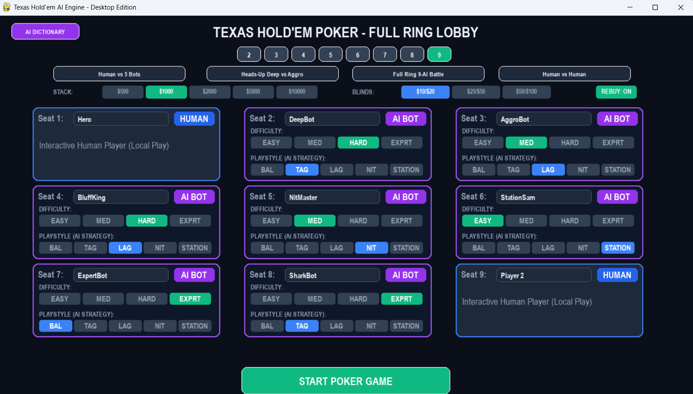
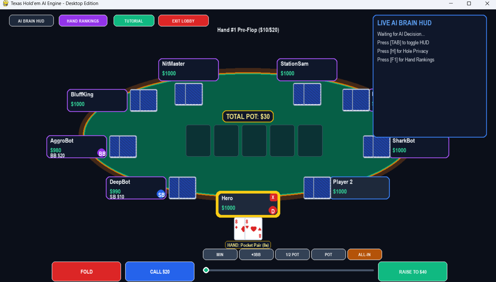
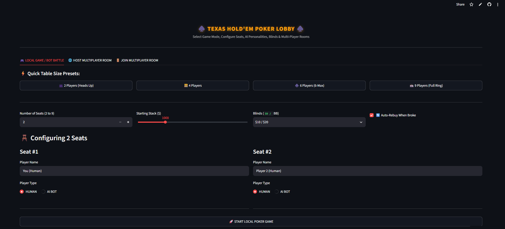
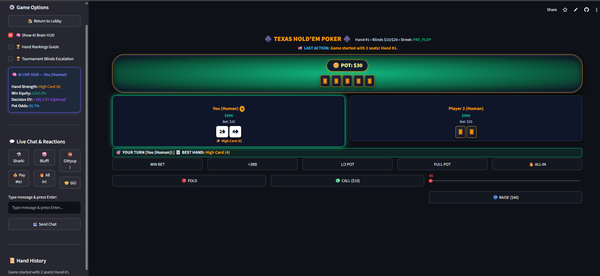

# ♠️ Texas Hold'em AI Engine & Web Platform

[](https://poker-ai-texas-holdem.streamlit.app/)

A comprehensive, full-featured Texas Hold'em Poker Engine featuring intelligent AI opponents, Monte Carlo equity & EV HUD, multiplayer rooms, and dual client support: a modern **Streamlit Web Interface** and a responsive **Pygame Desktop Client**.

🚀 **Live Web Application**: [https://poker-ai-texas-holdem.streamlit.app/](https://poker-ai-texas-holdem.streamlit.app/)

---

## 📸 Screenshots

### 🖥️ Pygame Desktop Client

#### 🃏 1. Desktop Lobby Screen
*Native 60 FPS Desktop interface for table configuration and game mode selection.*

<p align="center">
  
</p>

#### 🎮 2. Desktop Poker Table Screen
*Interactive desktop poker table rendering with chip displays and game controls.*

<p align="center">
  
</p>

---

### 🌐 Streamlit Web Platform
*Live App: [poker-ai-texas-holdem.streamlit.app](https://poker-ai-texas-holdem.streamlit.app/)*

#### 🃏 3. Streamlit Lobby & Multi-Seat Configuration
*Select Game Mode (Local / Multiplayer), Configure 2-9 Seats, Blinds, and AI Bot Personalities.*

<p align="center">
  
</p>

#### 🎮 4. Streamlit Interactive Poker Table & AI Live HUD
*Features felt oval table, real-time card rendering, live chat, and AI Live Brain HUD showing Win Equity %, Decision EV, and Pot Odds.*

<p align="center">
  
</p>

---

## ✨ Features

### ♠️ Core Poker Engine
- **Full Texas Hold'em Rule Engine**: Pre-flop, Flop, Turn, and River streets.
- **Betting & Pot Management**: Main pot, multiple Side Pots, Split Pots, All-In logic, and auto-showdown.
- **Hand Evaluation**: Fast 7-card evaluator supporting high card up to royal flush and tie-breaker algorithms.
- **Blinds & Seat Rotation**: Dealer button rotation, Small/Big Blind posting, and auto-rebuy when busted.

### 🧠 Intelligent AI Engine ("DeepBot")
- **Monte Carlo Equity Calculator**: Real-time simulation of win probabilities across unknown cards.
- **AI Live Brain HUD**: Displays current Hand Strength, Win Equity %, Decision EV, and Pot Odds.
- **Opponent & Range Modeling**: Analyzes player aggressiveness, position, stack-to-pot ratio (SPR), and board textures.
- **Multiple AI Profiles**:
  - 🦈 **TAG** (Tight-Aggressive)
  - 🔥 **LAG** (Loose-Aggressive)
  - 🛡️ **Tight Passive**
  - 🎲 **Loose Passive**
- **Difficulty Levels**: Easy, Medium, Hard.

### 🌐 Dual Interface Support
- **Streamlit Web Application (`app_streamlit.py`)**: Sleek dark-mode GUI with quick table size presets, seat builder, multiplayer room hosting/joining, and live chat.
- **Pygame Desktop Edition (`main.py`)**: Native 60 FPS desktop window with custom widgets, hand ranking reference, and responsive scaling.

---

## 📁 Project Structure

```
POKER/
├── AI/                     # AI Decision Engine & Monte Carlo Equity
│   ├── bet_sizing.py       # Dynamic bet size generator
│   ├── bluff_engine.py     # Bluff probability & decision engine
│   ├── board_analysis.py   # Board texture analysis (flush/straight draws)
│   ├── bot_player.py       # AI Player class & strategy executor
│   ├── decision.py         # Expected Value (EV) & action selector
│   ├── equity.py           # Monte Carlo simulator
│   ├── hand_strength.py    # Hand rank & percentile rating
│   ├── opponent_model.py   # Player profiling & history tracking
│   ├── position.py         # Table position advantages
│   ├── pot_odds.py         # Pot odds & implied odds calculator
│   ├── range_model.py      # Hand range modeling
│   └── strategy.py         # TAG, LAG, Passive strategy profiles
│
├── engine/                 # Core Game Logic & Rules
│   ├── betting.py          # Pot allocation & side pots
│   ├── betting_round.py    # Turn order & betting sequence
│   ├── dealer.py           # Deck shuffling & card dealing
│   ├── evaluator.py        # 7-card hand rank evaluator
│   ├── game.py             # Main Game Controller
│   └── game_state.py       # State snapshot for UI/AI
│
├── ui/                     # Pygame UI Components
│   ├── game_screen.py      # Pygame Table Screen
│   ├── lobby.py            # Pygame Lobby Screen
│   └── widgets.py          # Custom Pygame UI Buttons & Sliders
│
├── network/                # Multiplayer & Cloud Networking
│   └── server.py           # Room management & WebSocket server
│
├── app_streamlit.py        # Streamlit Web Application (Web GUI)
├── main.py                 # Pygame Desktop Application
├── server_cloud.py         # Cloud server launcher
├── build_exe.bat           # Executable packaging script
├── TexasHoldemAI.spec      # PyInstaller build specification
├── requirements.txt        # Full dependencies
├── requirements-streamlit.txt # Streamlit web dependencies
├── requirements-server.txt    # Server dependencies
└── README.md
```

---

## 🚀 Getting Started

### 1. Clone the Repository
```bash
git clone https://github.com/YOUR_USERNAME/Texas-Holdem-AI-Engine.git
cd Texas-Holdem-AI-Engine
```

### 2. Create and Activate Virtual Environment
```bash
# Windows
python -m venv venv
.\venv\Scripts\activate

# Linux / macOS
python3 -m venv venv
source venv/bin/activate
```

---

## 🎮 Running the Application

### Option A: Launch Streamlit Web Application (Recommended)
Install web dependencies and run Streamlit:
```bash
pip install -r requirements-streamlit.txt
streamlit run app_streamlit.py
```
*Access the app live at [https://poker-ai-texas-holdem.streamlit.app/](https://poker-ai-texas-holdem.streamlit.app/) or locally at `http://localhost:8501`.*

### Option B: Launch Pygame Desktop Application
Install full desktop dependencies and run main:
```bash
pip install -r requirements.txt
python main.py
```

### Option C: Run Cloud Multiplayer Server
```bash
pip install -r requirements-server.txt
python server_cloud.py
```

---

## 🧪 Testing & Verification

Run the automated test suite with `pytest`:
```bash
python -m pytest
```

Run an AI vs AI simulation test:
```bash
python -m tests.test_bot_vs_bot
```

---

## 🛠️ Building Standalone Desktop Executable (.exe)

To build a zero-dependency Windows executable using PyInstaller:
```powershell
.\build_exe.bat
```
The resulting executable will be generated inside the `dist/` directory.

---

## 🛠️ Technologies Used

- **Languages & Frameworks**: Python 3, Streamlit, Pygame, NumPy
- **Algorithms**: Monte Carlo Tree/Equity Simulation, Hand Evaluation, EV Calculations
- **Networking**: WebSockets / Global Room Management
- **Testing**: PyTest
- **Packaging**: PyInstaller

---

## 👤 Author

**Kshitij Kejriwal**  
MCA Student – Veermata Jijabai Technological Institute (VJTI)

---

## 📄 License

This project is open-source and intended for educational and research purposes.